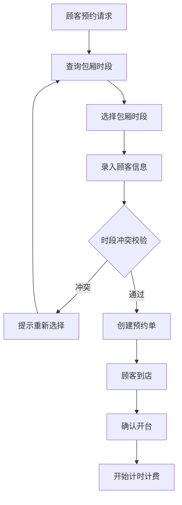
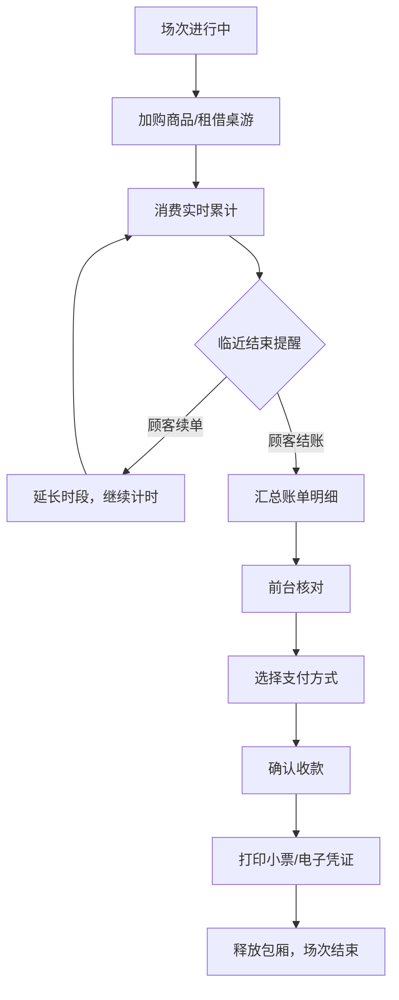
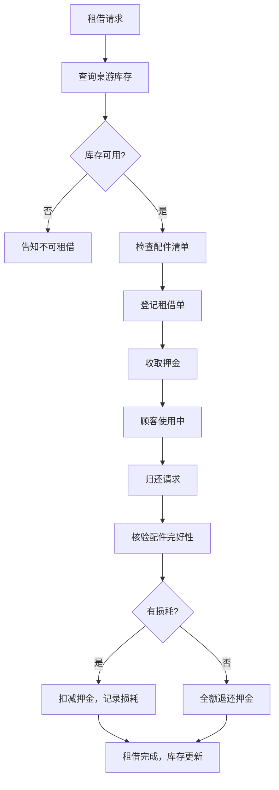

## 1. 产品概述

桌游休闲场馆综合管理平台，面向线下桌游吧、剧本杀门店等休闲娱乐场所，提供包厢预约、场次管理、桌游道具租借、消费结算的一站式数字化运营解决方案。通过系统化管理提升门店运营效率，减少人工差错，优化顾客消费体验。

- 核心解决问题：人工预约易冲突、道具租借管理混乱、账单计算易错、经营数据无统计
- 目标用户：桌游吧经营者、前台操作员、门店管理员
- 产品价值：降低运营成本，提高翻台率，数据驱动经营决策

## 2. 核心功能

### 2.1 用户角色

| 角色 | 注册方式 | 核心权限 |
|------|---------|---------|
| 超级管理员 | 系统初始化创建 | 全部功能权限，含系统配置、用户管理、经营报表 |
| 前台操作员 | 管理员后台创建 | 预约管理、开台结账、道具租借归还、消费结算 |

### 2.2 功能模块

1. **登录页**：账号密码登录、权限识别、会话管理
2. **工作台首页**：今日预约概览、包厢状态实时看板、待办提醒、快速操作入口
3. **包厢预约管理**：包厢列表、时段日历、新增/修改/取消预约、冲突校验
4. **场次运营管理**：当前开台包厢、计时状态、超时提醒、续单操作
5. **桌游道具管理**：桌游建档（类型/难度/人数）、库存管理、租借/归还登记、押金管理
6. **商品消费管理**：零食饮品商品库、点单加单、库存扣减
7. **消费结算中心**：账单合并（包厢费+租赁费+商品费）、多支付方式、小票打印、历史账单
8. **系统配置中心**：包厢规格与定价、超时计费规则、押金标准、支付方式配置
9. **经营统计报表**：包厢使用率、热门桌游排行、营收趋势、月度经营报表
10. **账号权限管理**：操作员账号增删改、角色分配、操作日志

### 2.3 页面详情

| 页面名称 | 模块名称 | 功能描述 |
|---------|---------|-----------|
| 登录页 | 登录表单 | 账号密码输入、登录校验、错误提示、记住密码 |
| 工作台 | 数据统计卡片 | 今日预约数、在台包厢数、今日营收、待处理提醒数 |
| 工作台 | 包厢状态看板 | 网格展示所有包厢，颜色区分空闲/使用中/已预约/维修中，显示剩余时长 |
| 工作台 | 今日预约列表 | 按时间排序展示今日预约，支持快速开台 |
| 工作台 | 超时预警区 | 临近结束（<15分钟）、已超时包厢红色高亮提醒 |
| 包厢预约 | 日历视图 | 按日期+包厢维度展示时段占用情况，色块标记 |
| 包厢预约 | 新增预约表单 | 顾客信息、选择包厢、日期时段、人数、备注、校验冲突 |
| 包厢预约 | 预约详情 | 预约信息展示、修改、取消、开台操作 |
| 场次运营 | 在台列表 | 当前所有开台包厢，显示包厢号、开始时间、已用时、预计结束、费用累计 |
| 场次运营 | 场次详情 | 包厢计时、加时操作、添加消费、结账按钮 |
| 桌游道具 | 桌游档案列表 | 支持按类型/难度/人数筛选，展示名称、库存、押金、状态 |
| 桌游道具 | 桌游建档/编辑 | 名称、封面图、类型、难度等级、适合人数、配件清单、押金、注意事项 |
| 桌游道具 | 租借登记 | 选择场次/顾客、选择桌游、登记配件、收押金、生成租借单 |
| 桌游道具 | 归还登记 | 扫码或选择租借单、检查配件完好、退押金、记录损耗 |
| 商品消费 | 商品列表 | 零食饮品分类展示、库存、单价、快捷加购按钮 |
| 商品消费 | 商品管理 | 新增/编辑商品、分类管理、库存调整 |
| 消费结算 | 账单详情 | 包厢时长费明细、租借费明细、商品费明细、优惠、合计 |
| 消费结算 | 支付操作 | 选择支付方式（现金/微信/支付宝/会员卡）、确认收款、找零计算 |
| 系统配置 | 包厢管理 | 新增包厢、设置名称/规格/容纳人数/基础价格 |
| 系统配置 | 计费规则 | 设置超时计费（每分钟/每半小时单价）、最低消费、包时段优惠 |
| 系统配置 | 通用设置 | 门店信息、提醒时间阈值、支付方式启用配置 |
| 经营报表 | 数据概览 | 本月/本周营收、包厢使用率、客单价、同比环比 |
| 经营报表 | 包厢统计 | 各包厢使用率排行、时段热力分布 |
| 经营报表 | 桌游排行 | 租借次数TOP10、热门类型分析 |
| 经营报表 | 营收趋势 | 日/周/月营收折线图、消费类型占比饼图 |
| 账号管理 | 用户列表 | 操作员列表、状态启用禁用、重置密码 |
| 账号管理 | 新增用户 | 用户名、密码、姓名、角色、联系方式 |

## 3. 核心流程

### 3.1 预约开台流程

顾客来电或到店咨询 → 前台查询包厢空闲时段 → 选择合适包厢与时段 → 录入顾客信息 → 系统校验时段冲突 → 创建预约（预约状态）→ 顾客到店 → 前台确认开台（场次状态变为进行中，开始计时）

### 3.2 消费结算流程

开台使用期间 → 可随时加购商品/租借桌游 → 场次时间临近结束系统提醒 → 顾客要求结账 → 系统汇总所有消费（包厢时长费+超时费+租赁费+商品费）→ 前台核对账单 → 选择支付方式 → 确认收款 → 打印小票 → 场次结束，包厢释放为空闲

### 3.3 桌游租借归还流程

顾客请求租借 → 前台查询桌游库存 → 选择目标桌游 → 检查配件完整性 → 登记租借单并收取押金 → 顾客使用 → 顾客归还 → 前台核验配件 → 确认无损 → 退还押金（扣减如有损耗）→ 更新库存状态

## 4. 用户界面设计

### 4.1 设计风格

- **主色调**：深墨绿 `#1F4E3C`（沉稳、专业、休闲感），搭配暖金色 `#D4AF37`（桌游氛围、尊贵感）
- **辅助色**：成功绿 `#22C55E`、警告橙 `#F97316`、危险红 `#EF4444`、信息蓝 `#3B82F6`
- **中性色**：炭灰 `#1E293B`、石板灰 `#64748B`、浅灰 `#F1F5F9`、纯白 `#FFFFFF`
- **按钮风格**：圆角8px，主按钮深墨绿配白字，悬停微上浮+阴影加深，按压时轻微下沉
- **字体**：标题使用「思源黑体 Bold」，正文使用「思源黑体 Regular」，数字使用等宽字体增强可读性
- **字号层级**：大标题28px、小标题20px、正文14px、辅助信息12px、数据卡片数字36px
- **布局风格**：左侧固定侧边栏导航 + 顶部信息栏 + 主内容区的经典后台布局；卡片式模块分区，统一圆角与阴影
- **图标风格**：Lucide React 线性图标，统一描边宽度，主色填充
- **整体氛围**：专业高效的后台管理系统，融入桌游主题的暖色调点缀，避免沉闷

### 4.2 页面设计概览

| 页面名称 | 模块名称 | UI 元素 |
|---------|---------|---------|
| 登录页 | 品牌区 | 深墨绿渐变背景、店名Logo、Slogan文字、装饰性骰子/卡牌图案 |
| 登录页 | 表单区 | 白色毛玻璃卡片、账号密码输入框、登录按钮、版本信息 |
| 工作台 | 统计卡片 | 4个彩色数据卡片，大数字+趋势箭头+同比小标签，图标装饰 |
| 工作台 | 包厢看板 | 网格布局，每个包厢卡片显示编号、状态标签、剩余时长进度条，空闲绿色、使用中金色、预约蓝色、维修灰色 |
| 工作台 | 提醒横幅 | 顶部滚动的超时预警/即将到店预约提示，红色闪烁吸引注意 |
| 包厢预约 | 日历网格 | 横向包厢列表、纵向时间段（09:00-次日02:00），色块标记占用，点击空白处创建预约，点击占用查看详情 |
| 场次运营 | 数据行 | 表格+卡片混合布局，每行一个场次，操作按钮组醒目突出 |
| 桌游档案 | 卡片网格 | 桌游封面图+名称+标签（类型/难度/人数）+库存数+押金，悬停放大效果 |
| 消费结算 | 账单明细 | 左侧分类折叠面板，右侧汇总金额大字体，支付方式图标按钮组 |
| 经营报表 | 图表区 | ECharts 折线/饼/柱状图组合，卡片式布局，时间范围筛选器在顶部 |

### 4.3 响应式

- 桌面端优先设计，适配 1366×768 及以上分辨率，主要针对门店前台电脑
- 侧边栏宽度 240px，支持折叠至 64px 仅显示图标
- 主内容区最小宽度 1080px，内部表格可横向滚动
- 弹窗/抽屉统一使用 8px 圆角，深色半透明遮罩
- 不强制适配移动端，但基础布局在平板上可用

### 4.4 交互动效

- 页面切换：淡入+轻微上移过渡，时长 200ms
- 按钮悬停：背景色过渡 + 上移1px + 阴影加深，时长 150ms
- 包厢状态变更：颜色渐变过渡，时长 300ms
- 提醒通知：右上角滑入，停留5秒后自动消失
- 模态弹窗：缩放+淡入，缩放从 0.95 到 1，时长 200ms
- 数据加载：骨架屏占位，脉冲动画
