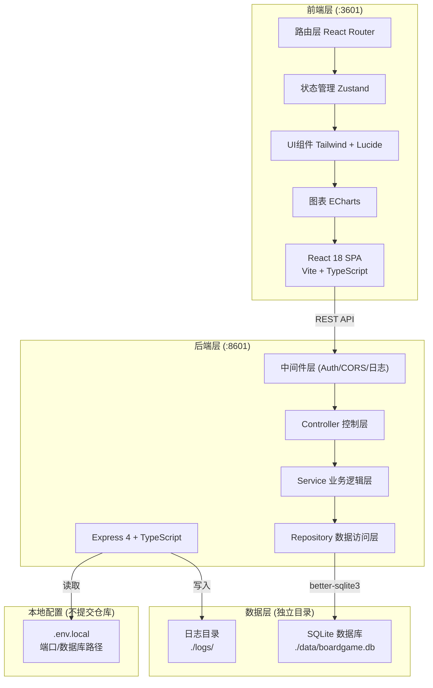
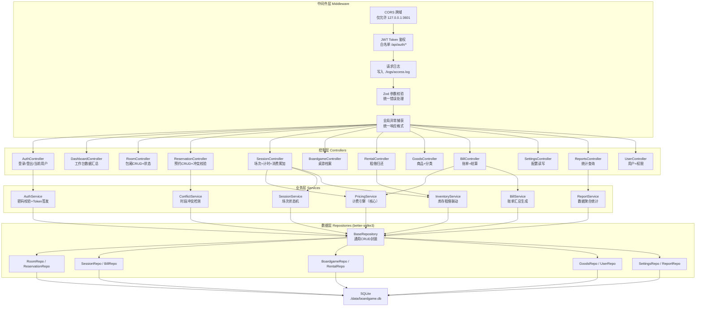
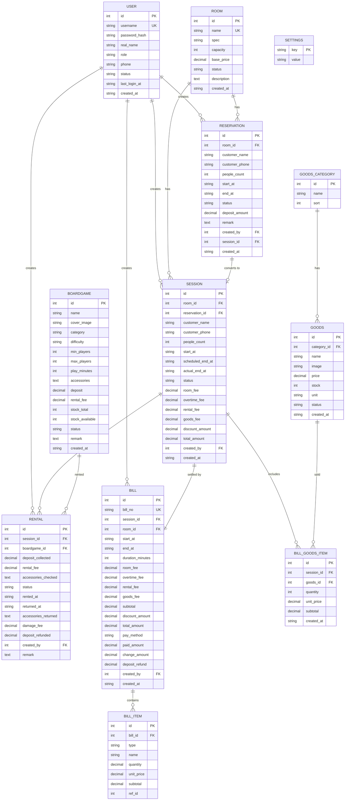

## 1. 架构设计



## 2. 技术描述

- **前端**：React 18 + TypeScript + Vite 6
  - 路由：react-router-dom@6
  - 状态管理：zustand@4
  - UI样式：tailwindcss@3 + postcss + autoprefixer
  - 图标：lucide-react
  - 图表：echarts + echarts-for-react
  - HTTP请求：axios
  - 日期处理：dayjs
- **初始化工具**：vite-init 使用 react-express-ts 模板
- **后端**：Express@4 + TypeScript + ESM
  - 数据库驱动：better-sqlite3（同步API，性能优秀，零依赖）
  - 参数校验：zod
  - 密码加密：bcryptjs
  - Token鉴权：jsonwebtoken
  - CORS：cors
  - 日志：自定义文件日志中间件
- **数据库**：SQLite（本地文件，无需额外服务，适合单店场景）
  - 数据文件位置：`./data/boardgame.db`（项目独立目录）
- **本地配置**：`.env.local`（添加到 .gitignore，不提交仓库）
  - 前端开发端口 VITE_PORT=3601
  - 后端服务端口 PORT=8601
  - 监听地址 HOST=127.0.0.1
  - 数据库路径 DB_PATH=./data/boardgame.db
  - 日志路径 LOG_PATH=./logs
  - JWT密钥 JWT_SECRET=（本地随机生成）

## 3. 路由定义

### 前端路由

| 路由路径 | 页面组件 | 权限 | 说明 |
|---------|---------|------|------|
| /login | Login | 公开 | 登录页 |
| /dashboard | Dashboard | 操作员+管理员 | 工作台首页 |
| /reservations | ReservationList | 操作员+管理员 | 包厢预约列表/日历 |
| /reservations/new | ReservationForm | 操作员+管理员 | 新增预约 |
| /sessions | SessionList | 操作员+管理员 | 当前场次运营 |
| /boardgames | BoardgameList | 操作员+管理员 | 桌游档案列表 |
| /boardgames/new | BoardgameForm | 管理员 | 新增桌游档案 |
| /rentals | RentalList | 操作员+管理员 | 租借归还管理 |
| /rentals/new | RentalForm | 操作员+管理员 | 新增租借登记 |
| /goods | GoodsList | 操作员+管理员 | 商品点单 |
| /goods/manage | GoodsManage | 管理员 | 商品库管理 |
| /checkout/:sessionId | Checkout | 操作员+管理员 | 消费结算 |
| /history/bills | BillHistory | 操作员+管理员 | 历史账单查询 |
| /settings/rooms | RoomSettings | 管理员 | 包厢配置 |
| /settings/pricing | PricingSettings | 管理员 | 计费规则配置 |
| /settings/general | GeneralSettings | 管理员 | 通用设置 |
| /reports/overview | ReportOverview | 管理员 | 经营数据概览 |
| /reports/revenue | ReportRevenue | 管理员 | 营收趋势报表 |
| /reports/boardgames | ReportBoardgames | 管理员 | 桌游租借统计 |
| /users | UserManage | 管理员 | 账号权限管理 |

### 后端 API 路由前缀

| 前缀 | 说明 |
|------|------|
| /api/auth | 登录登出、Token验证 |
| /api/dashboard | 工作台统计数据 |
| /api/rooms | 包厢管理 CRUD |
| /api/reservations | 预约管理 CRUD + 冲突校验 |
| /api/sessions | 场次管理（开台/续单/结账） |
| /api/boardgames | 桌游档案 CRUD |
| /api/rentals | 租借归还登记 |
| /api/goods | 商品管理 CRUD |
| /api/bills | 账单查询与导出 |
| /api/settings | 系统配置读写 |
| /api/reports | 统计报表数据 |
| /api/users | 用户管理 CRUD |

## 4. API 定义（TypeScript 类型）

```typescript
// 通用响应结构
interface ApiResponse<T> {
  code: number;       // 0 成功, 非0 错误码
  message: string;
  data: T;
}

interface PagedResult<T> {
  list: T[];
  total: number;
  page: number;
  pageSize: number;
}

// 鉴权模块
namespace Auth {
  interface LoginReq { username: string; password: string; }
  interface LoginResp {
    token: string;
    user: { id: number; username: string; realName: string; role: 'admin' | 'operator'; };
  }
  interface CurrentUser {
    id: number; username: string; realName: string; role: string;
    phone?: string; lastLoginAt?: string;
  }
}

// 包厢模块
namespace Room {
  interface Room {
    id: number;
    name: string;
    spec: 'small' | 'medium' | 'large' | 'vip';   // 小包/中包/大包/VIP
    capacity: number;                               // 容纳人数
    basePrice: number;                              // 基础单价（元/小时）
    status: 'available' | 'maintenance' | 'disabled';
    description?: string;
    createdAt: string;
  }
  interface RoomStatus extends Room {
    currentState: 'idle' | 'in_use' | 'reserved' | 'maintenance';
    currentSessionId?: number;
    remainingMinutes?: number;
    todayReservationCount: number;
  }
}

// 预约模块
namespace Reservation {
  type ReservationStatus = 'pending' | 'checked_in' | 'cancelled' | 'no_show';
  interface Reservation {
    id: number;
    roomId: number;
    roomName?: string;
    customerName: string;
    customerPhone: string;
    peopleCount: number;
    startAt: string;    // ISO 时间
    endAt: string;
    status: ReservationStatus;
    depositAmount: number;     // 预约订金
    remark?: string;
    createdBy: number;
    createdAt: string;
    sessionId?: number;        // 关联场次（开台后）
  }
  interface CheckConflictReq {
    roomId: number;
    startAt: string;
    endAt: string;
    excludeId?: number;
  }
  interface CheckConflictResp { conflict: boolean; conflicting?: Reservation[]; }
}

// 场次模块
namespace Session {
  type SessionStatus = 'active' | 'completed' | 'void';
  interface Session {
    id: number;
    roomId: number;
    roomName?: string;
    reservationId?: number;
    customerName?: string;
    customerPhone?: string;
    peopleCount: number;
    startAt: string;
    scheduledEndAt: string;           // 预定结束时间
    actualEndAt?: string;
    elapsedMinutes: number;           // 已用分钟（实时计算）
    overtimeMinutes: number;          // 超时分钟
    status: SessionStatus;
    roomFee: number;                  // 包厢费
    overtimeFee: number;              // 超时费
    rentalFee: number;                // 租借费
    goodsFee: number;                 // 商品费
    discountAmount: number;           // 优惠
    totalAmount: number;              // 合计
    createdBy: number;
    createdAt: string;
  }
  interface CreateSessionReq {
    roomId: number; reservationId?: number;
    customerName?: string; customerPhone?: string;
    peopleCount: number; hours: number;  // 初始时长
  }
  interface ExtendReq { sessionId: number; addHours: number; }
  interface AddConsumptionReq {
    sessionId: number;
    type: 'rental' | 'goods';
    itemId: number;
    quantity: number;
    unitPrice: number;
  }
}

// 桌游模块
namespace Boardgame {
  type Difficulty = 'easy' | 'medium' | 'hard' | 'expert';
  interface Boardgame {
    id: number;
    name: string;
    coverImage?: string;
    category: string;                 // 类型：策略/聚会/推理/卡牌/亲子 等
    difficulty: Difficulty;
    minPlayers: number;
    maxPlayers: number;
    playMinutes: number;              // 一局时长
    accessories: string;              // 配件清单（逗号分隔）
    deposit: number;                  // 押金
    rentalFee: number;                // 租借费（单次/场次）
    stockTotal: number;               // 总库存
    stockAvailable: number;           // 可用库存
    status: 'active' | 'archived';
    remark?: string;
    createdAt: string;
  }
}

// 租借模块
namespace Rental {
  type RentalStatus = 'active' | 'returned' | 'damaged' | 'lost';
  interface Rental {
    id: number;
    sessionId?: number;               // 关联场次
    sessionRoomName?: string;
    customerName?: string;
    boardgameId: number;
    boardgameName?: string;
    depositCollected: number;         // 实收押金
    rentalFee: number;                // 租借费
    accessoriesChecked: string;       // 借出时配件
    status: RentalStatus;
    rentedAt: string;
    returnedAt?: string;
    accessoriesReturned?: string;     // 归还时配件
    damageFee: number;                // 损坏扣费
    depositRefunded: number;          // 实退押金
    createdBy: number;
    remark?: string;
  }
}

// 商品模块
namespace Goods {
  interface Category { id: number; name: string; sort: number; }
  interface Goods {
    id: number;
    categoryId: number;
    categoryName?: string;
    name: string;
    image?: string;
    price: number;
    stock: number;
    unit: string;                     // 瓶/份/袋 等
    status: 'on_sale' | 'off_sale';
    createdAt: string;
  }
  interface GoodsItemInBill {
    id: number;
    goodsId: number;
    name: string;
    quantity: number;
    unitPrice: number;
    subtotal: number;
  }
}

// 账单模块
namespace Bill {
  type PayMethod = 'cash' | 'wechat' | 'alipay' | 'member' | 'mixed';
  interface Bill {
    id: number;
    billNo: string;                   // 账单编号 BG + 时间戳
    sessionId: number;
    roomId: number;
    roomName?: string;
    customerName?: string;
    startAt: string;
    endAt: string;
    durationMinutes: number;
    roomFee: number;
    overtimeFee: number;
    rentalFee: number;
    goodsFee: number;
    subtotal: number;
    discountAmount: number;
    totalAmount: number;
    payMethod: PayMethod;
    paidAmount: number;
    changeAmount: number;             // 找零
    depositRefund: number;            // 退押金
    createdBy: number;
    createdAt: string;
    items: BillItem[];
  }
  type BillItemType = 'room' | 'overtime' | 'rental' | 'goods';
  interface BillItem {
    id: number; billId: number;
    type: BillItemType;
    name: string;                    // 展示名称
    quantity: number;
    unitPrice: number;
    subtotal: number;
    refId?: number;                  // 关联ID
  }
  interface CheckoutReq {
    sessionId: number;
    discountAmount: number;
    payMethod: PayMethod;
    paidAmount: number;
  }
}

// 配置模块
namespace Settings {
  interface PricingRule {
    overtimeUnit: 'minute' | 'half_hour' | 'hour';
    overtimeRate: number;               // 超时单价（相对于基础价的倍数或绝对值）
    overtimeMode: 'ratio' | 'fixed';    // ratio=按基础价比例, fixed=固定单价
    minimumChargeMinutes: number;       // 最低消费分钟
    freeGraceMinutes: number;           // 免费宽限分钟（超时前免单）
    reminderMinutesBeforeEnd: number;   // 结束前提醒分钟
  }
  interface GeneralSetting {
    shopName: string;
    shopPhone: string;
    shopAddress: string;
    businessStartTime: string;          // HH:mm
    businessEndTime: string;            // HH:mm（支持次日，如 02:00）
    enabledPayMethods: Bill.PayMethod[];
    receiptFooter: string;
  }
}

// 报表模块
namespace Reports {
  interface OverviewData {
    todayRevenue: number;
    todayBillCount: number;
    todayAvgBill: number;
    todayRoomUtilization: number;       // 0-100%
    weekRevenue: number;
    monthRevenue: number;
    monthOnMonth: number;               // 环比%
    pendingReminders: number;
  }
  interface RevenuePoint { date: string; revenue: number; billCount: number; }
  interface RoomUsageStat {
    roomId: number; roomName: string;
    usedMinutes: number; utilizationRate: number; revenue: number;
  }
  interface BoardgameRentalRank {
    boardgameId: number; name: string;
    rentalCount: number; revenue: number;
  }
}

// 用户模块
namespace User {
  type Role = 'admin' | 'operator';
  interface User {
    id: number;
    username: string;
    realName: string;
    role: Role;
    phone?: string;
    status: 'active' | 'disabled';
    lastLoginAt?: string;
    createdAt: string;
  }
  interface CreateUserReq {
    username: string; password: string;
    realName: string; role: Role; phone?: string;
  }
  interface UpdateUserReq {
    realName?: string; role?: Role;
    phone?: string; status?: 'active' | 'disabled';
  }
  interface ResetPwdReq { userId: number; newPassword: string; }
}
```

## 5. 服务端架构图



## 6. 数据模型

### 6.1 ER 图



### 6.2 DDL 初始化脚本

```sql
-- ============================================================
-- 桌游管理平台 SQLite 数据库初始化脚本
-- ============================================================

-- 用户表
CREATE TABLE IF NOT EXISTS user (
    id INTEGER PRIMARY KEY AUTOINCREMENT,
    username TEXT NOT NULL UNIQUE,
    password_hash TEXT NOT NULL,
    real_name TEXT NOT NULL,
    role TEXT NOT NULL CHECK (role IN ('admin','operator')) DEFAULT 'operator',
    phone TEXT,
    status TEXT NOT NULL CHECK (status IN ('active','disabled')) DEFAULT 'active',
    last_login_at TEXT,
    created_at TEXT NOT NULL DEFAULT (datetime('now','localtime'))
);

-- 包厢表
CREATE TABLE IF NOT EXISTS room (
    id INTEGER PRIMARY KEY AUTOINCREMENT,
    name TEXT NOT NULL UNIQUE,
    spec TEXT NOT NULL CHECK (spec IN ('small','medium','large','vip')) DEFAULT 'medium',
    capacity INTEGER NOT NULL DEFAULT 4,
    base_price REAL NOT NULL DEFAULT 0,
    status TEXT NOT NULL CHECK (status IN ('available','maintenance','disabled')) DEFAULT 'available',
    description TEXT,
    created_at TEXT NOT NULL DEFAULT (datetime('now','localtime'))
);

-- 预约表
CREATE TABLE IF NOT EXISTS reservation (
    id INTEGER PRIMARY KEY AUTOINCREMENT,
    room_id INTEGER NOT NULL REFERENCES room(id),
    customer_name TEXT NOT NULL,
    customer_phone TEXT NOT NULL,
    people_count INTEGER NOT NULL DEFAULT 1,
    start_at TEXT NOT NULL,
    end_at TEXT NOT NULL,
    status TEXT NOT NULL CHECK (status IN ('pending','checked_in','cancelled','no_show')) DEFAULT 'pending',
    deposit_amount REAL NOT NULL DEFAULT 0,
    remark TEXT,
    created_by INTEGER NOT NULL REFERENCES user(id),
    session_id INTEGER REFERENCES session(id),
    created_at TEXT NOT NULL DEFAULT (datetime('now','localtime'))
);
CREATE INDEX IF NOT EXISTS idx_reservation_room_time ON reservation(room_id, start_at, end_at);
CREATE INDEX IF NOT EXISTS idx_reservation_status ON reservation(status);

-- 场次表
CREATE TABLE IF NOT EXISTS session (
    id INTEGER PRIMARY KEY AUTOINCREMENT,
    room_id INTEGER NOT NULL REFERENCES room(id),
    reservation_id INTEGER REFERENCES reservation(id),
    customer_name TEXT,
    customer_phone TEXT,
    people_count INTEGER NOT NULL DEFAULT 1,
    start_at TEXT NOT NULL,
    scheduled_end_at TEXT NOT NULL,
    actual_end_at TEXT,
    status TEXT NOT NULL CHECK (status IN ('active','completed','void')) DEFAULT 'active',
    room_fee REAL NOT NULL DEFAULT 0,
    overtime_fee REAL NOT NULL DEFAULT 0,
    rental_fee REAL NOT NULL DEFAULT 0,
    goods_fee REAL NOT NULL DEFAULT 0,
    discount_amount REAL NOT NULL DEFAULT 0,
    total_amount REAL NOT NULL DEFAULT 0,
    created_by INTEGER NOT NULL REFERENCES user(id),
    created_at TEXT NOT NULL DEFAULT (datetime('now','localtime'))
);
CREATE INDEX IF NOT EXISTS idx_session_status ON session(status);
CREATE INDEX IF NOT EXISTS idx_session_room ON session(room_id, status);

-- 桌游档案表
CREATE TABLE IF NOT EXISTS boardgame (
    id INTEGER PRIMARY KEY AUTOINCREMENT,
    name TEXT NOT NULL,
    cover_image TEXT,
    category TEXT NOT NULL DEFAULT '其他',
    difficulty TEXT NOT NULL CHECK (difficulty IN ('easy','medium','hard','expert')) DEFAULT 'medium',
    min_players INTEGER NOT NULL DEFAULT 2,
    max_players INTEGER NOT NULL DEFAULT 6,
    play_minutes INTEGER NOT NULL DEFAULT 60,
    accessories TEXT,
    deposit REAL NOT NULL DEFAULT 0,
    rental_fee REAL NOT NULL DEFAULT 0,
    stock_total INTEGER NOT NULL DEFAULT 1,
    stock_available INTEGER NOT NULL DEFAULT 1,
    status TEXT NOT NULL CHECK (status IN ('active','archived')) DEFAULT 'active',
    remark TEXT,
    created_at TEXT NOT NULL DEFAULT (datetime('now','localtime'))
);
CREATE INDEX IF NOT EXISTS idx_boardgame_category ON boardgame(category);
CREATE INDEX IF NOT EXISTS idx_boardgame_status ON boardgame(status);

-- 租借记录表
CREATE TABLE IF NOT EXISTS rental (
    id INTEGER PRIMARY KEY AUTOINCREMENT,
    session_id INTEGER REFERENCES session(id),
    boardgame_id INTEGER NOT NULL REFERENCES boardgame(id),
    deposit_collected REAL NOT NULL DEFAULT 0,
    rental_fee REAL NOT NULL DEFAULT 0,
    accessories_checked TEXT,
    status TEXT NOT NULL CHECK (status IN ('active','returned','damaged','lost')) DEFAULT 'active',
    rented_at TEXT NOT NULL DEFAULT (datetime('now','localtime')),
    returned_at TEXT,
    accessories_returned TEXT,
    damage_fee REAL NOT NULL DEFAULT 0,
    deposit_refunded REAL NOT NULL DEFAULT 0,
    created_by INTEGER NOT NULL REFERENCES user(id),
    remark TEXT
);
CREATE INDEX IF NOT EXISTS idx_rental_status ON rental(status);
CREATE INDEX IF NOT EXISTS idx_rental_session ON rental(session_id);

-- 商品分类表
CREATE TABLE IF NOT EXISTS goods_category (
    id INTEGER PRIMARY KEY AUTOINCREMENT,
    name TEXT NOT NULL UNIQUE,
    sort INTEGER NOT NULL DEFAULT 0
);

-- 商品表
CREATE TABLE IF NOT EXISTS goods (
    id INTEGER PRIMARY KEY AUTOINCREMENT,
    category_id INTEGER NOT NULL REFERENCES goods_category(id),
    name TEXT NOT NULL,
    image TEXT,
    price REAL NOT NULL DEFAULT 0,
    stock INTEGER NOT NULL DEFAULT 0,
    unit TEXT NOT NULL DEFAULT '份',
    status TEXT NOT NULL CHECK (status IN ('on_sale','off_sale')) DEFAULT 'on_sale',
    created_at TEXT NOT NULL DEFAULT (datetime('now','localtime'))
);
CREATE INDEX IF NOT EXISTS idx_goods_category ON goods(category_id);

-- 场次商品消费明细
CREATE TABLE IF NOT EXISTS session_goods_item (
    id INTEGER PRIMARY KEY AUTOINCREMENT,
    session_id INTEGER NOT NULL REFERENCES session(id),
    goods_id INTEGER NOT NULL REFERENCES goods(id),
    goods_name TEXT NOT NULL,
    quantity INTEGER NOT NULL DEFAULT 1,
    unit_price REAL NOT NULL DEFAULT 0,
    subtotal REAL NOT NULL DEFAULT 0,
    created_at TEXT NOT NULL DEFAULT (datetime('now','localtime'))
);
CREATE INDEX IF NOT EXISTS idx_goods_item_session ON session_goods_item(session_id);

-- 账单表
CREATE TABLE IF NOT EXISTS bill (
    id INTEGER PRIMARY KEY AUTOINCREMENT,
    bill_no TEXT NOT NULL UNIQUE,
    session_id INTEGER NOT NULL REFERENCES session(id),
    room_id INTEGER NOT NULL REFERENCES room(id),
    customer_name TEXT,
    start_at TEXT NOT NULL,
    end_at TEXT NOT NULL,
    duration_minutes INTEGER NOT NULL DEFAULT 0,
    room_fee REAL NOT NULL DEFAULT 0,
    overtime_fee REAL NOT NULL DEFAULT 0,
    rental_fee REAL NOT NULL DEFAULT 0,
    goods_fee REAL NOT NULL DEFAULT 0,
    subtotal REAL NOT NULL DEFAULT 0,
    discount_amount REAL NOT NULL DEFAULT 0,
    total_amount REAL NOT NULL DEFAULT 0,
    pay_method TEXT NOT NULL,
    paid_amount REAL NOT NULL DEFAULT 0,
    change_amount REAL NOT NULL DEFAULT 0,
    deposit_refund REAL NOT NULL DEFAULT 0,
    created_by INTEGER NOT NULL REFERENCES user(id),
    created_at TEXT NOT NULL DEFAULT (datetime('now','localtime'))
);
CREATE INDEX IF NOT EXISTS idx_bill_created ON bill(created_at);
CREATE INDEX IF NOT EXISTS idx_bill_pay ON bill(pay_method);

-- 账单明细表
CREATE TABLE IF NOT EXISTS bill_item (
    id INTEGER PRIMARY KEY AUTOINCREMENT,
    bill_id INTEGER NOT NULL REFERENCES bill(id),
    type TEXT NOT NULL CHECK (type IN ('room','overtime','rental','goods')),
    name TEXT NOT NULL,
    quantity REAL NOT NULL DEFAULT 0,
    unit_price REAL NOT NULL DEFAULT 0,
    subtotal REAL NOT NULL DEFAULT 0,
    ref_id INTEGER
);

-- 配置表（key-value）
CREATE TABLE IF NOT EXISTS settings (
    key TEXT PRIMARY KEY,
    value TEXT NOT NULL
);

-- 操作日志表
CREATE TABLE IF NOT EXISTS operation_log (
    id INTEGER PRIMARY KEY AUTOINCREMENT,
    user_id INTEGER NOT NULL REFERENCES user(id),
    username TEXT NOT NULL,
    module TEXT NOT NULL,
    action TEXT NOT NULL,
    target_id INTEGER,
    detail TEXT,
    ip TEXT,
    created_at TEXT NOT NULL DEFAULT (datetime('now','localtime'))
);
CREATE INDEX IF NOT EXISTS idx_log_user ON operation_log(user_id);
CREATE INDEX IF NOT EXISTS idx_log_time ON operation_log(created_at);

-- ============================================================
-- 初始数据
-- ============================================================

-- 默认管理员（密码: admin123，bcrypt 哈希）
INSERT OR IGNORE INTO user (username, password_hash, real_name, role) VALUES
('admin', '$2a$10$N9qo8uLOickgx2ZMRZoMyeIjZAgcfl7p92ldGxad68LJZdL17lhWy', '超级管理员', 'admin');

-- 默认操作员（密码: 123456）
INSERT OR IGNORE INTO user (username, password_hash, real_name, role) VALUES
('operator', '$2a$10$N9qo8uLOickgx2ZMRZoMyeIjZAgcfl7p92ldGxad68LJZdL17lhWy', '前台操作员', 'operator');

-- 示例包厢
INSERT OR IGNORE INTO room (name, spec, capacity, base_price, description) VALUES
('A101', 'small', 4, 30, '小包厢，适合3-4人小聚'),
('A102', 'small', 4, 30, '小包厢，温馨紧凑'),
('A201', 'medium', 8, 50, '中包厢，标准配置'),
('A202', 'medium', 8, 50, '中包厢，标准配置'),
('A301', 'large', 12, 80, '大包厢，适合多人聚会'),
('VIP01', 'vip', 15, 120, 'VIP豪华包厢，独立卫浴');

-- 示例桌游分类与商品分类
INSERT OR IGNORE INTO goods_category (name, sort) VALUES
('瓶装饮料', 1),
('现调饮品', 2),
('零食小吃', 3),
('简餐', 4);

-- 示例商品
INSERT OR IGNORE INTO goods (category_id, name, price, stock, unit, status) VALUES
(1, '可乐', 6, 100, '瓶', 'on_sale'),
(1, '雪碧', 6, 100, '瓶', 'on_sale'),
(1, '矿泉水', 3, 100, '瓶', 'on_sale'),
(2, '珍珠奶茶', 15, 50, '杯', 'on_sale'),
(3, '薯片', 10, 80, '袋', 'on_sale'),
(3, '瓜子', 8, 60, '袋', 'on_sale'),
(4, '泡面', 12, 40, '桶', 'on_sale');

-- 示例桌游
INSERT OR IGNORE INTO boardgame (name, category, difficulty, min_players, max_players, play_minutes, accessories, deposit, rental_fee, stock_total, stock_available) VALUES
('三国杀标准版', '卡牌', 'easy', 3, 10, 60, '卡牌x160,身份牌x10,血量牌x10,说明书x1', 100, 20, 3, 3),
('狼人杀', '聚会', 'easy', 6, 18, 45, '卡牌x36,号码牌x18,警徽x1', 80, 15, 2, 2),
('卡坦岛', '策略', 'medium', 3, 4, 90, '地图板x1,资源卡x95,建设卡x25,棋子x4套,骰子x2', 200, 35, 2, 2),
('璀璨宝石', '策略', 'medium', 2, 4, 45, '宝石筹码x90,发展卡x90,贵族卡x10', 150, 30, 2, 2),
('剧本杀-迷雾山庄', '推理', 'hard', 5, 8, 240, '剧本x8,线索卡x60,地图x1', 300, 80, 1, 1),
('UNO', '卡牌', 'easy', 2, 10, 30, '卡牌x108,说明书x1', 50, 10, 5, 5),
('大富翁经典版', '亲子', 'easy', 2, 6, 90, '棋盘x1,棋子x6,骰子x2,地契卡x28,钱币套装x1', 120, 20, 2, 2),
('展翅翱翔', '策略', 'hard', 1, 5, 60, '主版图x1,鸟类卡x170,蛋x100,食物tokenx50', 350, 50, 1, 1);

-- 系统配置默认值
INSERT OR IGNORE INTO settings (key, value) VALUES
('pricing_rule', '{"overtimeUnit":"half_hour","overtimeRate":1.0,"overtimeMode":"ratio","minimumChargeMinutes":60,"freeGraceMinutes":10,"reminderMinutesBeforeEnd":15}'),
('general_setting', '{"shopName":"桌游空间站","shopPhone":"400-123-4567","shopAddress":"示例街道123号","businessStartTime":"10:00","businessEndTime":"02:00","enabledPayMethods":["cash","wechat","alipay"],"receiptFooter":"感谢光临，欢迎再来！"}');
```
